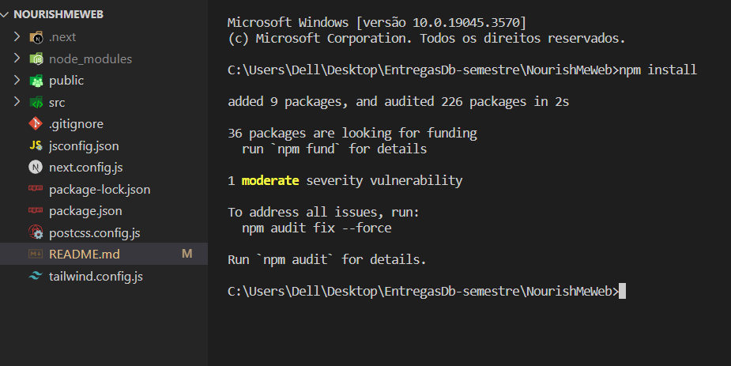
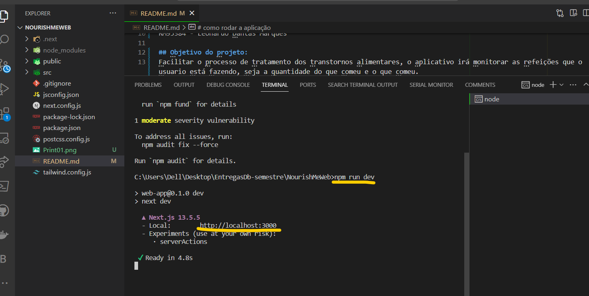
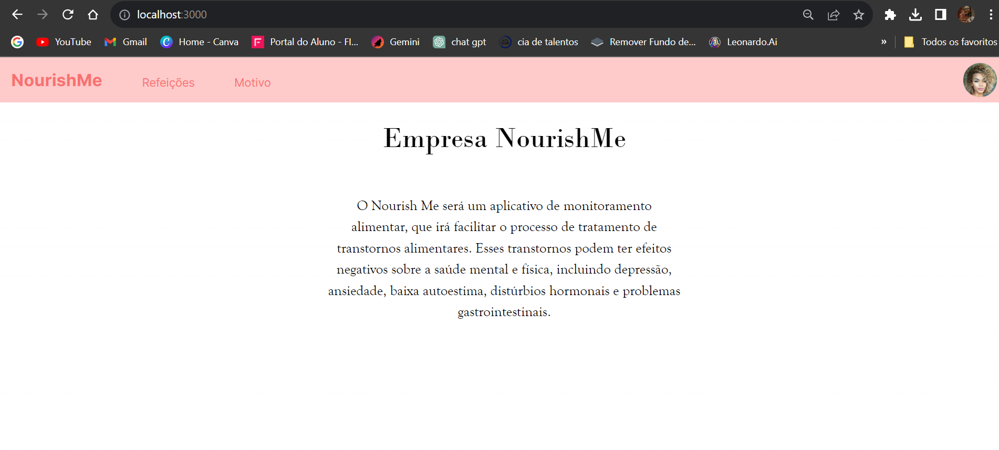

# Challenge-FIAP - NourishMe <!-- Listagem dos endpoints -->

# Integrantes

RM96269 - Bianca Dos Santos Pereira
RM95854 - Eduarda Nicoli Cavalheiro
RM93535 - Erik Siarkowski Salafia
RM95396 - Ingrid Vieira de Oliveira
RM95749 - João Vitor Santiago de Oliveira Braz
RM95384 - Leonardo Dantas Marques

## Objetivo do projeto:
Facilitar o processo de tratamento dos transtornos alimentares, o aplicativo irá monitorar as refeições que o usuario está fazendo, seja a quantidade do que comeu e o que comeu.

Vamos utilizar a API do GPT para criar um assistente emocional. Através dela, será possível integrar o modelo de linguagem natural do GPT em um aplicativo e desenvolver um assistente que possa conversar com usuários sobre seus sentimentos, problemas emocionais, estresse, ansiedade e outros temas relacionados à saúde mental. Além disso, o chat oferecerá sugestões, dicas e atividades que possam ajudar a pessoa a lidar melhor com suas emoções e sentimentos

-----------------------

# como rodar a aplicação 

Clone o repositório

Logo após execute o comando npm install no terminal do projeto

Em seguida execute o comando npm run dev para rodar a aplicação
(Lembrando que a api precisa estar rondando para que funcione o front)

abra o http://localhost:3000
